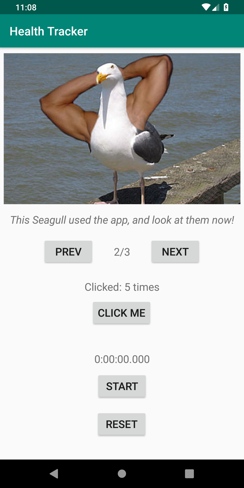
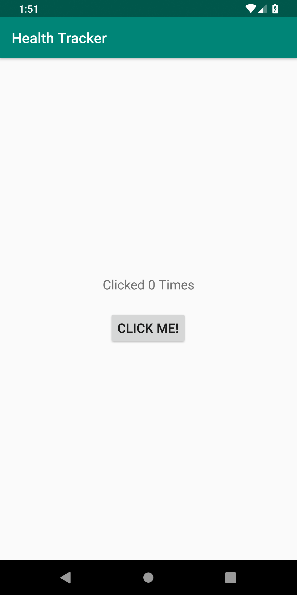
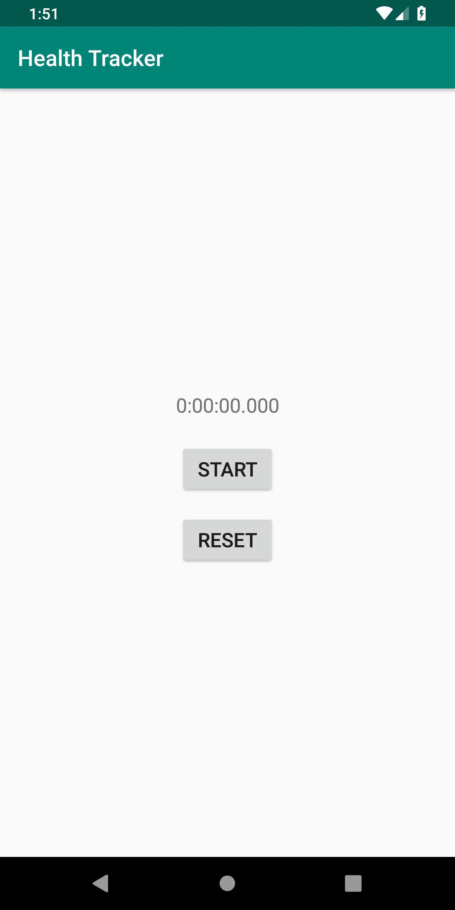

# Health Tracker
Health Tracker is an app built to help maintain a healthy lifestyle, and provide some inspiration along the way.

# Change Log
## 1/8/19
* Added Finger exercise to MainActivity
* Added StopWatch to MainActivity
* Updated StopWatch to be resumable and resettable 
* Created an InspirationalImage class
* Added an image carousel that features 3 InspirationalImages
* Image carousel now features 3 unique images and captions

## 1/9/19
* Moved Clicker Exercise to its own Activity
* Moved the Stopwatch to its own Activity
* Added ability to send an immediate notification

## 1/10/19
* Notifications run on a set delay
* Notifications all have a unique ID when they are enabled
* Notifications can be disabled
* Migrated project to AndroidX
